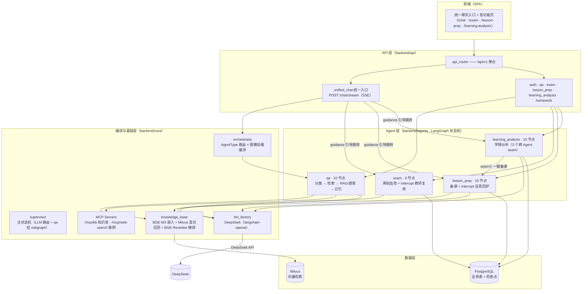

# K12TutorAgent — K12 AI 教学助教

面向 K12 教学场景的多 Agent 智能辅助系统：**智能问答 / 试卷批改 / 智能备课 / 学情报告** 四大 Agent，由统一的 AI 助手入口做意图路由分发。后端基于 **FastAPI + LangGraph + PostgreSQL + Milvus + DeepSeek**，全链路（含 RAG 检索）已闭环，e2e 全绿。

> 本项目是简历「项目一」的完整实现蓝图。技术栈以**代码为准**（PostgreSQL / Milvus / DeepSeek / asyncio）。

---

## 系统架构



> 独立矢量图（贴简历/PPT 用）：[docs/architecture.svg](docs/architecture.svg) —— 浏览器打开可另存为 PNG。

**分层职责**

| 层 | 模块 | 职责 |
|---|---|---|
| API 层 | `api/router.py` + `api/v1/*.py` | 路由聚合、认证、各 Agent 的 HTTP 端点（含 interrupt 恢复） |
| 统一入口 | `api/v1/unified_chat.py` | 意图路由（规则前置拦截 + LLM 分类）→ QA 直连流式 / 其余引导跳转 / 多 Agent 计划 |
| 调度层 | `core/supervisor.py` | 顶层主状态机（LangGraph supervisor 图）：LLM 决策路由 + qa 挂 subgraph + 其余引导节点 |
| 编排层 | `core/orchestrator.py` | Agent 类型定义 + 编译图懒加载缓存（轻量：不直驱 domain agent） |
| Agent 层 | `agents/{qa,exam,lesson_prep,learning_analysis}` | 四个 LangGraph 状态机，各自独立 state + AsyncPostgresSaver 持久化检查点 |
| 基础层 | `core/{llm_factory,knowledge_base,memory,retry,logger,exceptions}` | LLM 工厂、RAG、多轮记忆、三层兜底、结构化日志、统一异常 |
| 数据层 | PostgreSQL + Milvus | 业务数据 / 检查点 + 向量检索 |

---

## 四大 Agent

### 1. 智能问答（qa）· 10 节点
RAG 问答：意图分类（规则层 + MiniLM 重训）→ 检索（HyDE / Multi-Query 改写 / 直检）→ 精排 → RAG/联网/直答三分支 → 记忆压缩。
- 节点：`classify_query → (retrieve | hyde_generate | multi_query_rewrite | generate_general) → retrieve → (generate_rag | web_search | generate_direct) → save_memory`
- SSE 流式：`progress → token → meta`。

### 2. 试卷批改（exam）· 9 节点
Word 答卷两轨批改（客观题规则判分 / 简答题 LLM 评分）+ 教师复核回环。
- 节点：`parse_word → load_questions_meta → run_three_tracks → aggregate_results → analyze_weak_points → notify_teacher → teacher_review[interrupt] → apply_teacher_decision → publish_results`
- e2e 20/20。

### 3. 智能备课（lesson_prep）· 10 节点
教案生成 + 习题匹配 + 质检 + 反思回炉。
- 节点：`requirement_parse → semantic_retrieve → (objective_generate ∥ key_point_analyze) → process_generate → exercise_match → quality_check → lesson_plan_integrate → reflection_optimize[interrupt] → save_lesson_plan`

### 4. 学情报告（learning_analysis）· 10 节点
班级掌握度 / 分层画像 / 典型错题 / 教学建议，质检防 LLM 篡改数字。
- 节点：`requirement_parse → data_fetch → (mastery_calc ∥ typical_error) → stratify → intervention_retrieval → suggestion_gen → report_integration → report_validation → persistence`
- **3 个跨 Agent seam**：① 一键备课（报告 → 教案）② 作业数据回流 ③ 教案当干预策略参考。

---

## 技术栈

| 分类 | 选型 |
|---|---|
| Web 框架 | FastAPI 0.117 + Uvicorn + sse-starlette（SSE 流式） |
| Agent 编排 | LangGraph 1.0（状态机 + AsyncPostgresSaver 持久化检查点 + interrupt 人机协同） |
| LLM | DeepSeek（经 langchain-openai 兼容接口，`llm_factory` 统一路由） |
| 向量检索 | Milvus 2.4（BGE-M3 dense+sparse 混合召回） + BGE-Reranker 精排 |
| 嵌入 | FlagEmbedding BGE-M3（本地加载） |
| 意图分类 | all-MiniLM-L6-v2（规则层 + 微调） |
| 数据库 | PostgreSQL 15（SQLAlchemy async + asyncpg） |
| 认证 | JWT（python-jose） |
| 文档解析 | python-docx（Word 试卷） / PyMuPDF（PDF） |

---

## 目录结构

```
backend/
├── main.py                     # 应用入口：路由聚合 + 迁移 + 模型预热 + MCP
├── config.py                   # 配置中心（读 .env.local）
├── dependencies.py             # DB 会话 + JWT 鉴权依赖
├── api/
│   ├── router.py               # api_router 总聚合
│   └── v1/                     # auth / unified_chat / qa / exam / lesson_prep / learning_analysis / homework
├── core/                       # orchestrator / llm_factory / knowledge_base / memory / retry / logger / exceptions / reranker / query_classifier
├── agents/
│   ├── qa/                     # 状态机：graph.py + state.py + nodes.py + prompts.py
│   ├── exam/
│   ├── lesson_prep/
│   └── learning_analysis/
├── mcp_servers/                # 知识库检索 + Web 搜索（FastMCP）
└── db/migrations.py            # 启动时幂等迁移（新表/新列）
scripts/
├── init_db.sql                 # 全量表结构
├── init_milvus.py              # Milvus 集合初始化
├── build_knowledge_base.py     # 知识库建库（切分 + 嵌入 + 入库）
├── seed_*.py                   # 各类测试数据（exam / lesson / learning）
└── manual_tests/               # 各 Agent e2e（真实 HTTP）
```

---

## 快速开始

### 1. 依赖与基础设施

```bash
# Python 环境（用 .venv，非 conda）
python -m venv .venv && .venv/Scripts/pip install -r requirements.txt   # Windows；Linux/Mac 用 .venv/bin/pip

# 起 PostgreSQL + Milvus（含 etcd/minio/attu）
docker compose up -d
```

### 2. 配置

复制 `.env.local`，填 DB（`db_host/db_port/db_user/db_password`）、Milvus（`milvus_host/milvus_port`）、DeepSeek（`deepseek_api_key`）、JWT（`jwt_secret_key`）。

### 3. 建库建索引 + 灌数据

```bash
# 建表（幂等）＋ Milvus 集合
.venv/Scripts/python.exe test/run_init_db.py          # 执行 scripts/init_db.sql 建表
.venv/Scripts/python.exe scripts/init_milvus.py       # Milvus 集合
# 测试账号 + 知识库 + 各 Agent 测试数据
.venv/Scripts/python.exe scripts/seed_data.py         # 灌 4 个测试账号（teacher01 等）
.venv/Scripts/python.exe scripts/build_knowledge_base.py
.venv/Scripts/python.exe scripts/seed_exam_math.py
.venv/Scripts/python.exe scripts/seed_lesson_data.py
.venv/Scripts/python.exe scripts/seed_learning_data.py
```

> 注：新表（作业/学情相关）已由 `backend/db/migrations.py` 在应用启动时幂等迁移，无需手动建。

### 4. 启动服务

```bash
PYTHONUTF8=1 PYTHONPATH=. .venv/Scripts/python.exe -m backend.main
# 健康检查：GET http://localhost:8000/health
# Swagger：  http://localhost:8000/docs
```

测试账号：`teacher01 / Teacher@123456`（班级 `c1a55e00-...`）。

---

## API 一览（前缀 `/api/v1`）

| 模块 | 端点 |
|---|---|
| 认证 | `POST /auth/login` · `GET /auth/me` |
| 统一入口 | `POST /chat/stream`（SSE 意图路由） |
| 问答 | `POST /qa/chat` · `POST /qa/chat/stream` · `GET /qa/sessions/{id}/history` |
| 试卷批改 | `POST /exam/submit` · `POST /exam/demo-submit` · `GET /exam/my-submissions` · `GET /exam/my-submissions/{id}` · `GET /exam/pending-reviews` · `GET /exam/submissions/{id}/review` · `POST /exam/submissions/{id}/confirm` |
| 备课 | `POST /lesson-prep/generate` · `POST /lesson-prep/generate/stream` · `GET /lesson-prep/sessions/{id}/plan` · `POST /lesson-prep/confirm` · `GET /lesson-prep/plans` · `GET /lesson-prep/plans/{id}` · `DELETE /lesson-prep/plans/{id}` |
| 学情报告 | `POST /learning-analysis/generate` · `POST /learning-analysis/generate/stream` · `GET /learning-analysis/reports` · `GET /learning-analysis/report/{id}` · `DELETE /learning-analysis/report/{id}` · `POST /learning-analysis/report/{id}/generate-lesson` · `GET /learning-analysis/exams` · `POST /learning-analysis/check-data` |
| 作业 | `POST /homework` · `GET /homework` · `GET /homework/{id}` · `POST /homework/{id}/submit` · `GET /exercises` |
| MCP | `/mcp/kb` · `/mcp/web-search` |

---

## 测试与验收

各 Agent 均有真实 HTTP e2e（`scripts/manual_tests/`，先起服务再跑）：

```bash
.venv/Scripts/python.exe scripts/manual_tests/test_qa.py                 # 问答 8 场景
.venv/Scripts/python.exe scripts/manual_tests/test_lesson_prep.py       # 备课回炉
.venv/Scripts/python.exe scripts/manual_tests/test_learning_analysis.py # 学情全链路
.venv/Scripts/python.exe scripts/manual_tests/test_exam.py              # 试卷批改 20/20
```

> `test/run_exam.py` 是早期 exam 未进 main.py 时的临时独立服务（单独挂 auth+exam），现已并入 main，不再需要。

验收结果汇总见 [`docs/acceptance.md`](docs/acceptance.md)，RAG 质量评测见 [`docs/ragas_report.md`](docs/ragas_report.md)。

统一入口路由分发（规则拦截 / QA 直连 / 引导跳转 / 多 Agent 计划）均已实测通过。

---

## 遗留优化项（非阻塞）

- 高中（10~12 年级）数据/语料未灌：当前知识点/习题/语料为小学数学，K12 扩展需补高中各科数据
- 学情报告摘要向量化后置（MVP 未实现：`learning_reports` 落库未同步灌 Milvus 摘要向量，历史报告暂不支持语义检索）
- 个体画像 / 错因 LLM 增强的价值依赖真实作业数据回流积累
